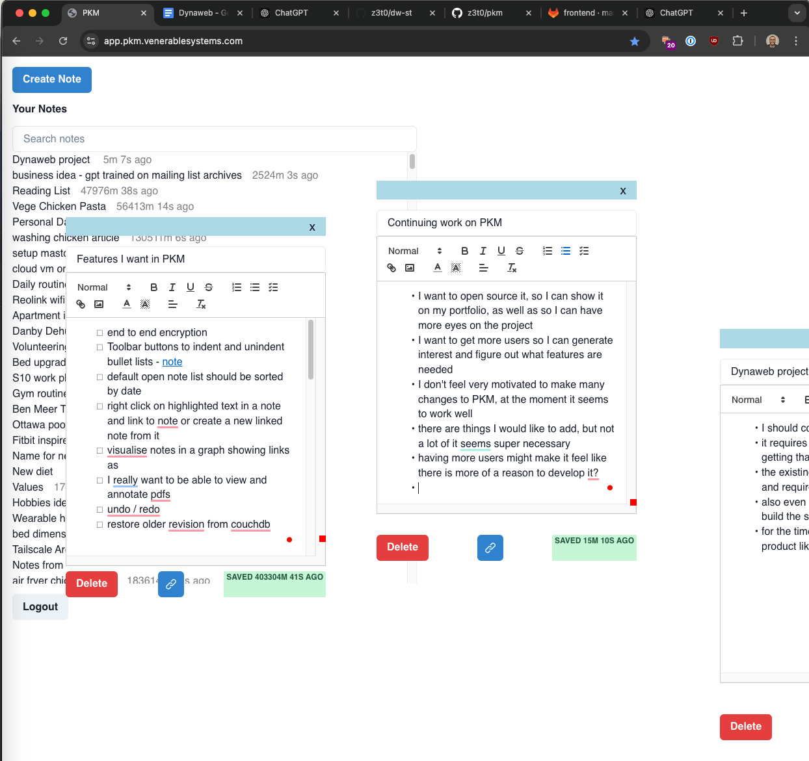

# pkm

A flexible, browser based note taking app.

It is in early development.



WIP Setting up a demo site: 
- https://z3t0.github.io/pkm/ 
- the site is not fully functional yet

## Keybindings
- Alt-x to open the command-bar
- Ctr-o to search for a note

## Features
- Open multiple notes at once
- Real-time syncing between devices
- Rich text editor for notes (quill.js)
- Generate links directly to a note
- Embed links to other notes within a note. 
  - When clicked, the note opens in the same window, preventing a loss of context
- Basic text search 
- Basic command bar for running specific actions
- Basic window manager, allows you to look at multiple notes, searches etc at the same time.

## Design Notes
- Uses couchdb for the database in the cloud, synced to a local pouchdb in the browser.
- There is no need for a backend, we're targetting a p2p architecture
- Thus, the client is the full application.

## Design Principles
- Be fast. Don't frustrate the user by making them wait.
- Keep the infrastructure simple
  - Any user should be able to run the entire application by themselves if they wanted to.
  
## Other notes
- Keep dependencies minimal.
- Testing, documentation, examples are encouraged.

## Setup developer environment
Requirements:
- Node
- Docker
- GNU/Linux environment
- Python3


### Running the database
First time setup.

The script asks for sudo, when creating certain files with permissions.
It takes ~1 minute.
```sh
cd devDb
./configure_db.sh
```

Then you can run the database
```sh
./start.sh
```

### Running the frontend
```sh
cd frontend
npm install
npm start
```

The frontend should be running on http://localhost:8080

You can login using the test user credentials:
- test@test.com
- test123

## Demo site
The demo site is deployed at https://z3t0.github.io/pkm/

To deploy manually:
```sh
cd frontend
npm install
npm run build:dev
npm run deploy:gh-pages
```

This requires write access to the gh-pages branch on this repo.


The site is also automatically deployed with the CI.
The CI runs on all pushes at the moment.
This [issue](https://github.com/z3t0/pkm/issues/12) tracks a task to make the deployment only run for pushes on the main branch.


## License
All first-party code in this repo is under AGPLv3 unless otherwise noted.